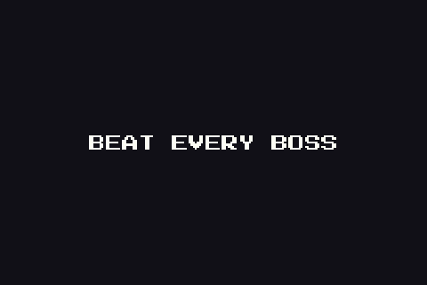

# Ditto's Climb



A top-down action roguelite for the Game Boy Advance. You play Ditto and climb thirteen floors of a dungeon,
from Cinnabar Lab to Cerulean Cave. Beat a wild Pokémon or a boss, and you can transform into it and use its
moves. The full design is in [docs/design.md](docs/design.md).

Watch the [30-second trailer](https://github.com/Jeramai/dittos-climb/releases/download/v1.1.3/dittos-climb-promo.mp4).

## Play

Download `dittos-climb.gba` from the [latest release](https://github.com/Jeramai/dittos-climb/releases/latest). It
is free.

- **Emulator:** open the ROM in [mGBA](https://mgba.io) or any other GBA emulator.
- **Game Boy Advance:** copy the ROM to a flash cart.
- **Nintendo 3DS (custom firmware):** play it with open_agb_firm or the mGBA homebrew app. To put it on the HOME
  Menu as its own icon, use [shortcut3ds](https://github.com/Jeramai/shortcut3ds).

## Controls

| Button | Action |
|---|---|
| D-pad | Move |
| A (hold) | Move 1 |
| B | Move 2 |
| L | Dodge |
| R (hold) | Lock aim while moving; an arrow shows the aim |
| Select (tap) | Use the item in the bag |
| Select (hold) | Drop the current form and go back to DITTO |
| A (on the stairs) | Go up to the next floor |
| Start | Floor map / continue |
| B (on the floor map) | Controls screen |
| R (on the title screen) | Options: music and sound volume, saved with the Pokédex |
| Select (on the title screen) | Pokédex of the species seen and the forms used, across runs; D-pad moves, L/R turn pages, A shows a shiny |
| A (on the floor map) | Read the collected journal pages; Left/Right turn, B goes back |
| Select (on the floor map) | Save and quit; A confirms, B goes back |

A saved run shows **A: CONTINUE** on the title screen. Continuing deletes the save, so a run resumes once.

## Build

Requires devkitPro with `gba-dev` (`sudo dkp-pacman -S gba-dev`) and Python 3 with Pillow.

```
git submodule update --init
make -j8
make run
```

`make release VERSION=1.2.0` builds the ROM and publishes it as a GitHub release. The latest ROM is always on the
repo's Releases page.

`make assets` regenerates the placeholder art from `tools/gen_assets.py`. `make artbook` rebuilds the
[art book](docs/artbook/README.md), a page with every sprite and tileset per floor. `make audio` regenerates
the original chiptune music (ProTracker MODs, one per floor plus title, boss, final boss and ending) and the
sound effects (WAVs) in `audio/` from `tools/gen_audio.py`.

Test builds take these flags in `USERFLAGS` (use a separate `BUILD` folder, because `make` does not rebuild on a flag change):

| Flag | Effect |
|---|---|
| `-DDITTO_TEST_START_KIND=1` | Start in a combat room, which is also the key item room (Poké Flute, Silph Scope) |
| `-DDITTO_TEST_START_KIND=2` | Start in the stairs room, with the Poké Flute |
| `-DDITTO_TEST_FORM=<species>` | Start transformed (1 Rattata, 2 Meowth, 3 Porygon, 4 Snorlax, 5 Oddish, 6 Caterpie, 7 Paras, 8 Beedrill, 9 Venusaur, 10 Geodude, 11 Diglett, 12 Zubat, 13 Onix, 14 Magikarp, 15 Poliwag, 16 Staryu, 17 Horsea, 18 Gyarados, 19 Pikachu, 20 Voltorb, 21 Magnemite, 22 Zapdos, 23 Machop, 24 Charmander, 25 Bulbasaur, 26 Sandshrew, 27 Vulpix, 28 Ponyta, 29 Growlithe, 30 Magmar, 31 Squirtle, 32 Moltres, 33 Seel, 34 Jynx, 35 Shellder, 36 Omanyte, 37 Articuno, 38 Pidgey, 39 Spearow, 40 Aerodactyl, 41 Kabuto, 42 Pidgeot, 43 Koffing, 44 Ekans, 45 Grimer, 46 Slowpoke, 47 Arbok, 48 Weezing, 49 Mankey, 50 Machoke, 51 Farfetch'd, 52 Hitmonlee, 53 Hitmonchan, 54 Gastly, 55 Haunter, 56 Cubone, 57 Exeggcute, 58 Gengar, 59 Dratini, 60 Dragonair, 61 Seadra, 62 Lapras, 63 Dragonite, 64 Abra, 65 Kadabra, 66 Drowzee, 67 Venomoth, 68 Mewtwo, 69 Mew) |
| `-DDITTO_TEST_NO_ENEMIES` | Combat rooms spawn nothing |
| `-DDITTO_TEST_FLOOR=<n>` | Start on floor n (2 Viridian Forest, 3 Rock Tunnel, 4 Underground Lake, 5 Power Plant, 6 Volcano, 7 Seafoam Cave, 8 The Chasm, 9 Rocket Hideout, 10 Fighting Dojo, 11 Pokémon Tower, 12 Dragon's Den, 13 Cerulean Cave) |
| `-DDITTO_TEST_OVERGROWN` | Every door of the start room is overgrown with bushes |
| `-DDITTO_TEST_REWARD=<n>` | The start room holds a reward (1 journal page, 2 rare Pokémon, 3 item) |
| `-DDITTO_TEST_ITEM=<n>` | The item reward (0 Charcoal … 8 Leftovers, 9 Quick Claw, 10 Ether, 11 Rare Candy, 12 Potion) |
| `-DDITTO_TEST_FALL` | Start on a pit (floors with pits only) |
| `-DDITTO_TEST_WARP` | Start on a warp pad (floor 13) |
| `-DDITTO_TEST_ENDING=<pages>` | Go straight to the ending with this many journal pages (13 shows the secret) |
| `-DDITTO_TEST_LAYOUT=<n>` | The start combat room uses layout n (0–4; 3 has a centre block) |
| `-DDITTO_TEST_SCOPE` | Start with the Silph Scope |
| `-DDITTO_TEST_SHINY` | Every wild Pokémon and the test form are shiny |
| `-DDITTO_TEST_BOSS_HP=<n>` | The boss has n HP (its maximum too, so Mewtwo does not Recover) |
| `-DDITTO_TEST_DEX` | The Pokédex starts partly filled (seen, used and shiny entries) and the wallet is set to 500 coins at boot |
| `-DDITTO_TEST_MART` | Every floor with items has a Poké Mart, the run starts in it, and the wallet is set to 500 coins at boot |
| `-DDITTO_TEST_PAGES=<n>` | Start with n journal pages (13 unlocks the secret ending) |
| `-DDITTO_TEST_SPECIES=<species>` | Every wild Pokémon is this species |

```
make TARGET=test-boss BUILD=build-test-boss USERFLAGS="-DDITTO_TEST_START_KIND=2 -DDITTO_TEST_FORM=1"
```

### End-to-end tests

`make e2e` plays scripted scenarios in a headless mGBA and writes screenshots, a GIF per scenario and
`build-e2e/report/index.html`. The checks are visual: open the report and look. It needs `brew install cmake lua@5.4
ffmpeg coreutils`; the first run builds mGBA into `tools/e2e/.mgba/`. `tools/e2e/run.sh stairs aim` runs only those.

A scenario in `tools/e2e/scenarios/` names its test flags on a `-- flags:` line and lists its input as `PLAN` steps:
`{ frames = n, keys = { "A", "UP" } }` holds keys for n frames, `{ shot = "name" }` saves a screenshot. The start
transform blocks input for about 200 frames, and a boss card lasts 130 frames.

## Credits

Code, pixel art and chiptunes by Jeramai & Claude. Built with [Butano](https://github.com/GValiente/butano) by
Gustavo Valiente. The trailer uses the [Press Start 2P](https://fonts.google.com/specimen/Press+Start+2P) font.

## License

The code, pixel art, music and sound effects are under the [MIT License](LICENSE): use, change and share them as
you like. Butano has its own zlib license.

## Disclaimer

Ditto's Climb is a free, non-commercial fan project. It is not affiliated with, endorsed or sponsored by Nintendo,
Creatures Inc., GAME FREAK inc. or The Pokémon Company. Pokémon and all Pokémon names and characters are trademarks
of Nintendo, Creatures Inc. and GAME FREAK inc. The MIT License does not cover them.
