# Ditto's Climb — art book

Every sprite and tileset in the game, per floor, with a sample room of each floor's tiles. All art is generated placeholder art from
`tools/gen_assets.py`; a hand-drawn BMP of the same size and palette limit (16 colours) replaces it.

Regenerate this page with `make artbook`.

Sprite strips show: walk 1, walk 2, player form (pink outline), and the special frame (asleep, charging,
mound) when the Pokémon has one.

## 1F · Cinnabar Lab

Tutorial lab. Doors lock until the room is clear. Find the Poké Flute to wake Snorlax.

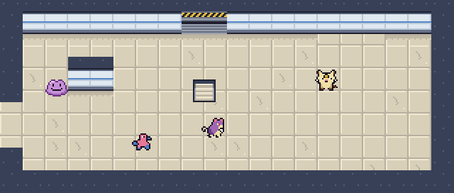

| Sprite | Shiny | Pokémon | Type | Move A | Move B | Role |
|---|---|---|---|---|---|---|
| 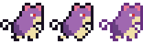 | 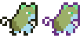 | **RATTATA** | Normal | TACKLE (Normal, 40) | HYPER FANG (Normal, 80, 15 PP) | Wild |
|  |  | **MEOWTH** | Normal | SCRATCH (Normal, 40) | PAY DAY (Normal, 40, 20 PP) | Wild |
| 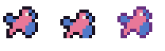 | 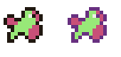 | **PORYGON** | Normal | TRI ATTACK (Normal, 30) | PSYBEAM (Psychic, 65, 15 PP) | Wild |
|  |  | **MACHOP** | Fighting | KARATE CHOP (Fighting, 50) | LOW KICK (Fighting, 60, 15 PP) | Rare (side room) |
|  |  | **SNORLAX** | Normal | HEADBUTT (Normal, 70) | BODY SLAM (Normal, 85, 10 PP) | Boss |

## 2F · Viridian Forest

Tall grass hides wild Pokémon. Bushes block side doors: a Grass form uses Cut.

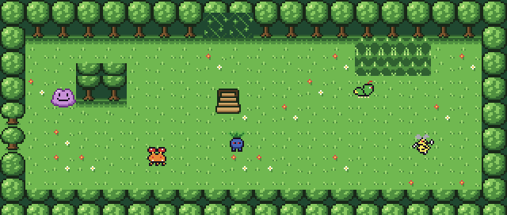

| Sprite | Shiny | Pokémon | Type | Move A | Move B | Role |
|---|---|---|---|---|---|---|
|  |  | **ODDISH** | Grass / Poison | ABSORB (Grass, 30) | STUN SPORE (Grass, —, 10 PP) | Wild |
| 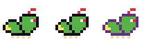 |  | **CATERPIE** | Bug | TACKLE (Normal, 40) | STRING SHOT (Bug, 10, 20 PP) | Wild |
|  |  | **PARAS** | Bug / Grass | SCRATCH (Normal, 40) | LEECH LIFE (Bug, 50, 15 PP) | Wild |
| 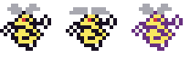 | 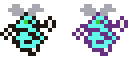 | **BEEDRILL** | Bug / Poison | TWINEEDLE (Bug, 25) | FURY ATTACK (Normal, 60, 15 PP) | Wild |
|  |  | **CHARMANDER** | Fire | EMBER (Fire, 40) | FLAMETHROWER (Fire, 55, 10 PP) | Rare (side room) |
|  |  | **VENUSAUR** | Grass / Poison | RAZOR LEAF (Grass, 35) | SOLAR BEAM (Grass, 120, 5 PP) | Boss |

## 3F · Rock Tunnel

Darkness: only a circle of light around Ditto. Diglett travel underground.

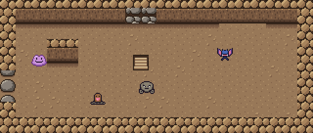

| Sprite | Shiny | Pokémon | Type | Move A | Move B | Role |
|---|---|---|---|---|---|---|
|  |  | **GEODUDE** | Rock / Ground | ROCK THROW (Rock, 50) | ROLLOUT (Rock, 60, 15 PP) | Wild |
|  |  | **ZUBAT** | Poison / Flying | LEECH LIFE (Bug, 50) | SUPERSONIC (Normal, —, 15 PP) | Wild |
|  |  | **DIGLETT** | Ground | SCRATCH (Normal, 40) | DIG (Ground, 80, 10 PP) | Wild |
|  |  | **BULBASAUR** | Grass / Poison | VINE WHIP (Grass, 45) | LEECH SEED (Grass, 30, 10 PP) | Rare (side room) |
|  |  | **ONIX** | Rock / Ground | ROCK THROW (Rock, 50) | SLAM (Normal, 80, 10 PP) | Boss |
|  |  | Onix Segment | | | | Boss |

## 4F · Underground Lake

Rivers with currents and ponds. Only Water and Flying forms swim; every river has a bridge.

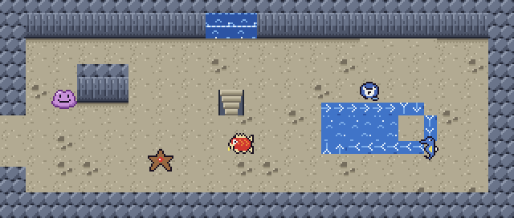

| Sprite | Shiny | Pokémon | Type | Move A | Move B | Role |
|---|---|---|---|---|---|---|
|  |  | **MAGIKARP** | Water | SPLASH (Water, —) | TACKLE (Normal, 40, 35 PP) | Wild |
|  |  | **POLIWAG** | Water | BUBBLE (Water, 25) | HYPNOSIS (Psychic, —, 15 PP) | Wild |
|  |  | **STARYU** | Water | WATER GUN (Water, 40) | SWIFT (Normal, 25, 15 PP) | Wild |
|  | 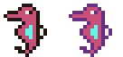 | **HORSEA** | Water | WATER GUN (Water, 40) | BUBBLEBEAM (Water, 45, 15 PP) | Wild |
|  |  | **PIKACHU** | Electric | THUNDERSHOCK (Electric, 40) | QUICK ATTACK (Normal, 40, 30 PP) | Rare (side room) |
|  |  | **MAGIKARP** | Water | SPLASH (Water, —) | TACKLE (Normal, 40, 35 PP) | Boss |
|  |  | **GYARADOS** | Water / Flying | BITE (Normal, 60) | HYDRO PUMP (Water, 110, 5 PP) | Boss |

## 5F · Power Plant

Floor plates charge and shock; the lights flicker. Ground types are immune.

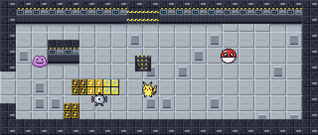

| Sprite | Shiny | Pokémon | Type | Move A | Move B | Role |
|---|---|---|---|---|---|---|
|  |  | **PIKACHU** | Electric | THUNDERSHOCK (Electric, 40) | QUICK ATTACK (Normal, 40, 30 PP) | Wild |
|  |  | **VOLTORB** | Electric | SONICBOOM (Normal, 40) | SELFDESTRUCT (Normal, 130, 1 PP) | Wild |
|  |  | **MAGNEMITE** | Electric | THUNDERSHOCK (Electric, 40) | THUNDER WAVE (Electric, —, 20 PP) | Wild |
|  |  | **SANDSHREW** | Ground | SCRATCH (Normal, 40) | DIG (Ground, 80, 10 PP) | Rare (side room) |
| 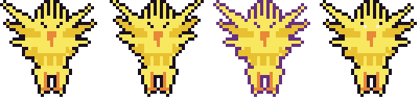 | 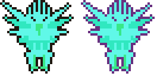 | **ZAPDOS** | Electric / Flying | THUNDERSHOCK (Electric, 40) | THUNDER (Electric, 110, 5 PP) | Boss |

## 6F · Volcano

Lava cycles crust, glow and molten; embers fall from the ceiling. Fire types walk on lava.

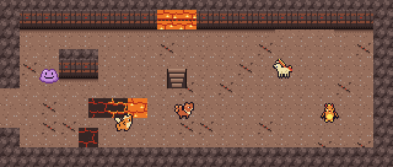

| Sprite | Shiny | Pokémon | Type | Move A | Move B | Role |
|---|---|---|---|---|---|---|
| 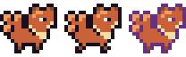 | 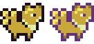 | **VULPIX** | Fire | EMBER (Fire, 40) | CONFUSE RAY (Ghost, —, 15 PP) | Wild |
|  | 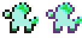 | **PONYTA** | Fire | TACKLE (Normal, 40) | FIRE SPIN (Fire, 35, 15 PP) | Wild |
| 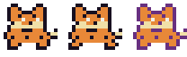 | 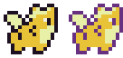 | **GROWLITHE** | Fire | BITE (Normal, 60) | FLAMETHROWER (Fire, 55, 10 PP) | Wild |
| 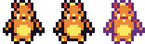 |  | **MAGMAR** | Fire | FIRE PUNCH (Fire, 55) | SMOG (Poison, 20, 20 PP) | Wild |
|  |  | **SQUIRTLE** | Water | WATER GUN (Water, 40) | BUBBLEBEAM (Water, 45, 15 PP) | Rare (side room) |
| 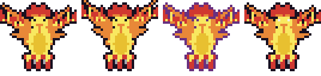 | 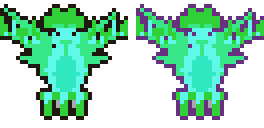 | **MOLTRES** | Fire / Flying | EMBER (Fire, 40) | SKY ATTACK (Flying, 140, 5 PP) | Boss |

## 7F · Seafoam Cave

Slippery ice patches. Frozen side doors: a Fire form melts them. Freeze status.

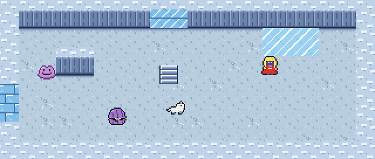

| Sprite | Shiny | Pokémon | Type | Move A | Move B | Role |
|---|---|---|---|---|---|---|
|  |  | **SEEL** | Water | HEADBUTT (Normal, 70) | AURORA BEAM (Ice, 50, 15 PP) | Wild |
|  |  | **JYNX** | Ice / Psychic | ICE PUNCH (Ice, 55) | LOVELY KISS (Normal, —, 10 PP) | Wild |
|  |  | **SHELLDER** | Water | CLAMP (Water, 35) | ICE BEAM (Ice, 90, 10 PP) | Wild |
|  |  | **OMANYTE** | Rock / Water | WATER GUN (Water, 40) | ROCK SLIDE (Rock, 60, 10 PP) | Rare (side room) |
| 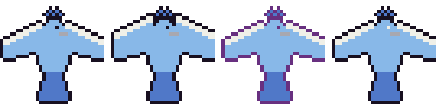 | 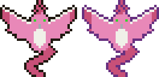 | **ARTICUNO** | Ice / Flying | ICE SHARD (Ice, 40) | BLIZZARD (Ice, 60, 5 PP) | Boss |

## 8F · The Chasm

Wind bands push walkers; pits drop Ditto one room back. Flying forms ignore both.

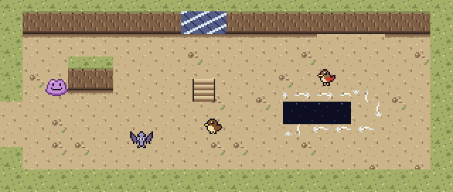

| Sprite | Shiny | Pokémon | Type | Move A | Move B | Role |
|---|---|---|---|---|---|---|
| 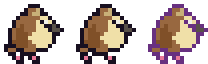 |  | **PIDGEY** | Normal / Flying | GUST (Flying, 35) | QUICK ATTACK (Normal, 40, 30 PP) | Wild |
| 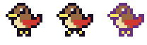 | 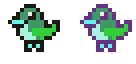 | **SPEAROW** | Normal / Flying | PECK (Flying, 35) | FURY ATTACK (Normal, 60, 15 PP) | Wild |
|  |  | **AERODACTYL** | Rock / Flying | BITE (Normal, 60) | ROCK SLIDE (Rock, 60, 10 PP) | Wild |
|  |  | **KABUTO** | Rock / Water | SCRATCH (Normal, 40) | ROCK SLIDE (Rock, 60, 10 PP) | Rare (side room) |
| 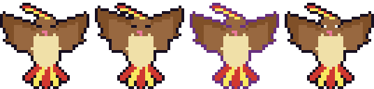 | 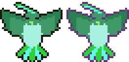 | **PIDGEOT** | Normal / Flying | GUST (Flying, 35) | WING ATTACK (Flying, 60, 15 PP) | Boss |

## 9F · Rocket Hideout

Spinner arrow lanes and poison gas vents. One room drops the Silph Scope.

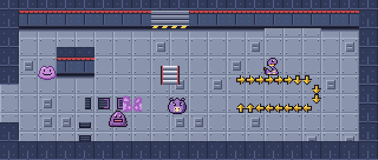

| Sprite | Shiny | Pokémon | Type | Move A | Move B | Role |
|---|---|---|---|---|---|---|
|  |  | **KOFFING** | Poison | TACKLE (Normal, 40) | SELFDESTRUCT (Normal, 130, 1 PP) | Wild |
| 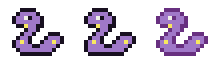 | 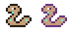 | **EKANS** | Poison | POISON STING (Poison, 30) | GLARE (Normal, —, 15 PP) | Wild |
|  |  | **GRIMER** | Poison | SLUDGE (Poison, 45) | POISON GAS (Poison, —, 20 PP) | Wild |
| 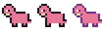 |  | **SLOWPOKE** | Water / Psychic | WATER GUN (Water, 40) | CONFUSION (Psychic, 50, 15 PP) | Rare (side room) |
|  |  | **ARBOK** | Poison | POISON STING (Poison, 30) | WRAP (Normal, 60, 15 PP) | Boss |
| 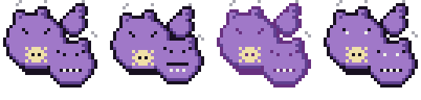 | 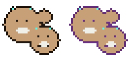 | **WEEZING** | Poison | SLUDGE (Poison, 45) | SELFDESTRUCT (Normal, 130, 1 PP) | Boss |
|  |  | Balloon | | | | Boss |

## 10F · Fighting Dojo

Three waves per room, no held items. Cracked rocks: a Fighting form uses Rock Smash.

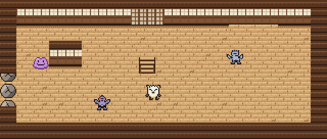

| Sprite | Shiny | Pokémon | Type | Move A | Move B | Role |
|---|---|---|---|---|---|---|
|  |  | **MANKEY** | Fighting | KARATE CHOP (Fighting, 50) | THRASH (Normal, 90, 10 PP) | Wild |
|  |  | **MACHOP** | Fighting | KARATE CHOP (Fighting, 50) | LOW KICK (Fighting, 60, 15 PP) | Wild |
|  |  | **MACHOKE** | Fighting | KARATE CHOP (Fighting, 50) | SUBMISSION (Fighting, 80, 15 PP) | Wild |
| 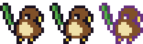 | 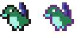 | **FARFETCH'D** | Normal / Flying | PECK (Flying, 35) | WING ATTACK (Flying, 60, 15 PP) | Rare (side room) |
| 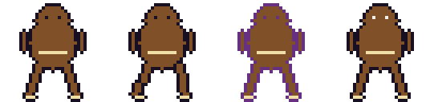 |  | **HITMONLEE** | Fighting | ROLLING KICK (Fighting, 60) | HI JUMP KICK (Fighting, 110, 5 PP) | Boss |
|  | 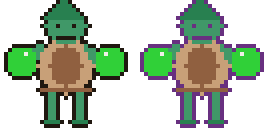 | **HITMONCHAN** | Fighting | FIRE PUNCH (Fire, 55) | MEGA PUNCH (Normal, 80, 10 PP) | Boss |

## 11F · Pokemon Tower

Dark tower. Ghosts are invisible without the Silph Scope. Spirit barriers need a Ghost form.

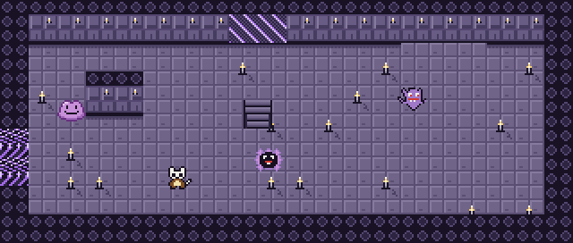

| Sprite | Shiny | Pokémon | Type | Move A | Move B | Role |
|---|---|---|---|---|---|---|
|  |  | **GASTLY** | Ghost / Poison | LICK (Ghost, 30) | CONFUSE RAY (Ghost, —, 15 PP) | Wild |
|  |  | **HAUNTER** | Ghost / Poison | LICK (Ghost, 30) | NIGHT SHADE (Ghost, 45, 15 PP) | Wild |
|  |  | **CUBONE** | Ground | BONE CLUB (Ground, 50) | BONEMERANG (Ground, 45, 10 PP) | Wild |
|  |  | **EXEGGCUTE** | Grass / Psychic | PSYWAVE (Psychic, 40) | CONFUSION (Psychic, 50, 15 PP) | Rare (side room) |
|  |  | **GENGAR** | Ghost / Poison | LICK (Ghost, 30) | SHADOW BALL (Ghost, 70, 10 PP) | Boss |

## 12F · Dragon'S Den

Large rooms with waterfalls and whirlpools.

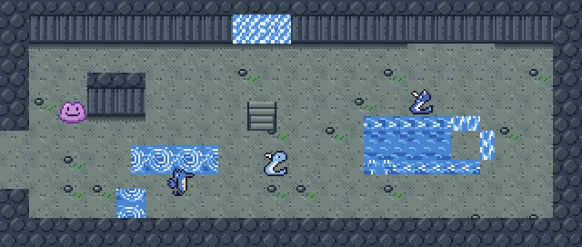

| Sprite | Shiny | Pokémon | Type | Move A | Move B | Role |
|---|---|---|---|---|---|---|
|  | 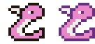 | **DRATINI** | Dragon | TWISTER (Dragon, 40) | THUNDER WAVE (Electric, —, 20 PP) | Wild |
| 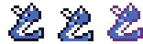 | 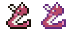 | **DRAGONAIR** | Dragon | TWISTER (Dragon, 40) | DRAGON RAGE (Dragon, 40, 10 PP) | Wild |
|  | 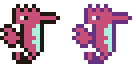 | **SEADRA** | Water | WATER GUN (Water, 40) | BUBBLEBEAM (Water, 45, 15 PP) | Wild |
|  |  | **LAPRAS** | Water / Ice | ICE SHARD (Ice, 40) | ICE BEAM (Ice, 90, 10 PP) | Rare (side room) |
|  |  | **DRAGONITE** | Dragon / Flying | TWISTER (Dragon, 40) | HYPER BEAM (Normal, 150, 5 PP) | Boss |

## 13F · Cerulean Cave

Warp pads send Ditto to their partner. Abra and Kadabra teleport.

| Sprite | Shiny | Pokémon | Type | Move A | Move B | Role |
|---|---|---|---|---|---|---|
|  |  | **ABRA** | Psychic | PSYWAVE (Psychic, 40) | TELEPORT (Psychic, —, 20 PP) | Wild |
|  |  | **KADABRA** | Psychic | PSYWAVE (Psychic, 40) | PSYBEAM (Psychic, 65, 15 PP) | Wild |
|  |  | **DROWZEE** | Psychic | PSYWAVE (Psychic, 40) | HYPNOSIS (Psychic, —, 15 PP) | Wild |
|  |  | **VENOMOTH** | Bug / Poison | LEECH LIFE (Bug, 50) | PSYBEAM (Psychic, 65, 15 PP) | Rare (side room) |
|  |  | **MEWTWO** | Psychic | PSYWAVE (Psychic, 40) | PSYCHIC (Psychic, 90, 10 PP) | Boss |

## Shared art

**Ditto: walk, squish, white (Transform), own walk, own squish, flat (dodge)**

**Mew (ending)**

**Projectiles**

**Water, dragon, ice and ghost projectiles**

**Electric, fire and flying projectiles**

**Clouds: Stun Spore, Sleep Powder, Fire Spin, Smog, Blizzard, Whirlwind**

**Melee slash**

**Struggle effort lines**

**Item ball, journal page, Silph Scope**

**Poké Flute**

**Light circle mask (dark floors)**

**HP bar** (green, yellow, red at full)

**Floor map tiles**

